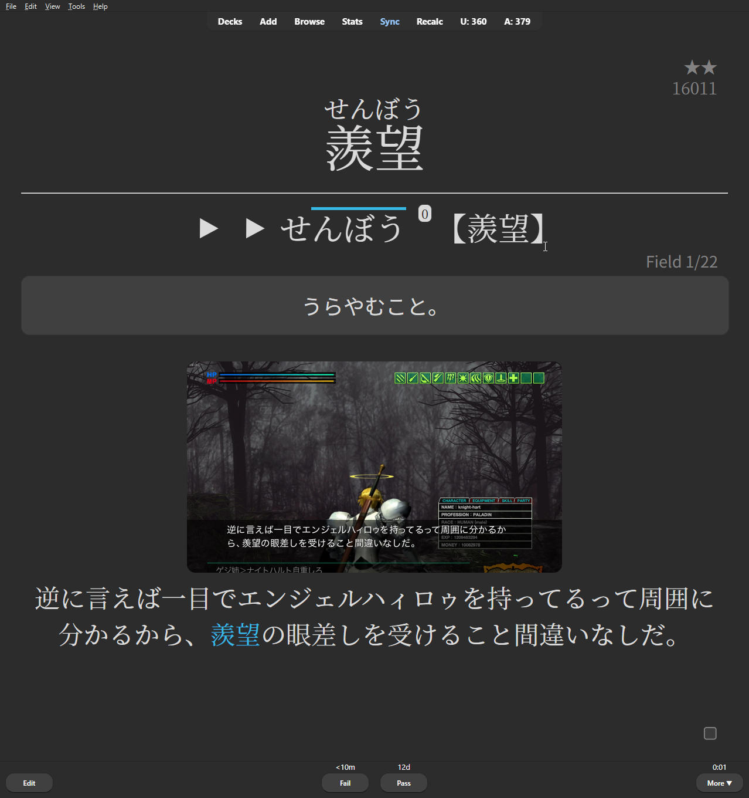
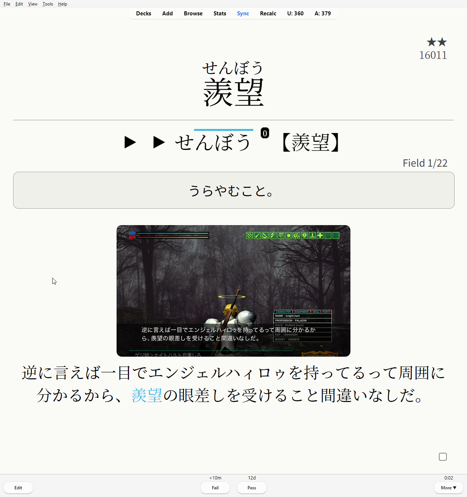
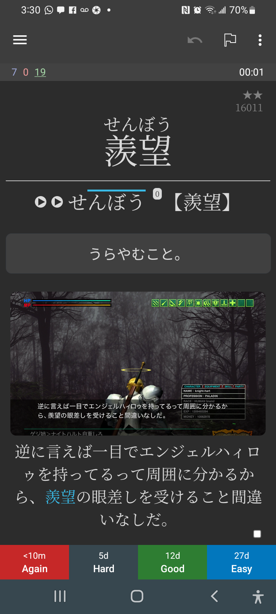
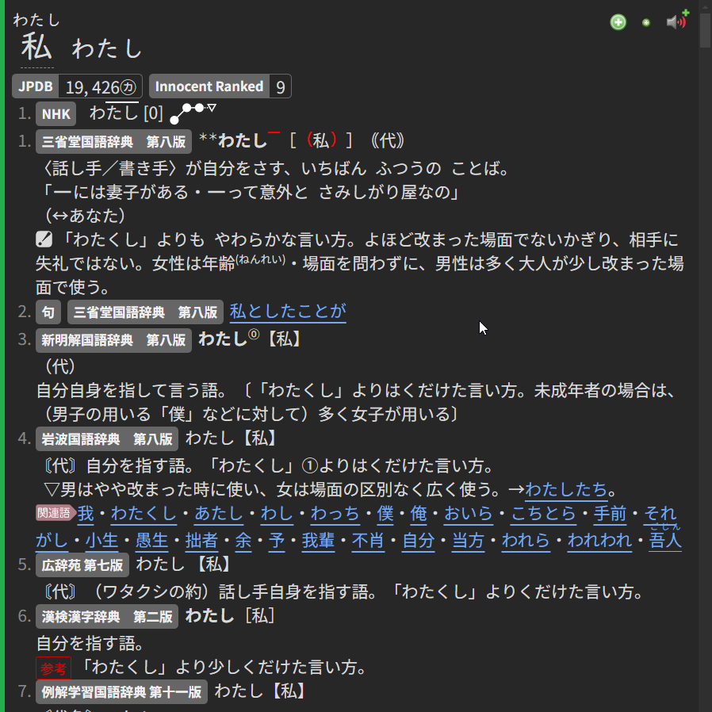
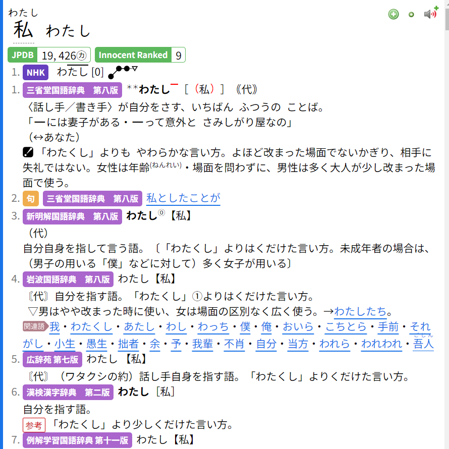
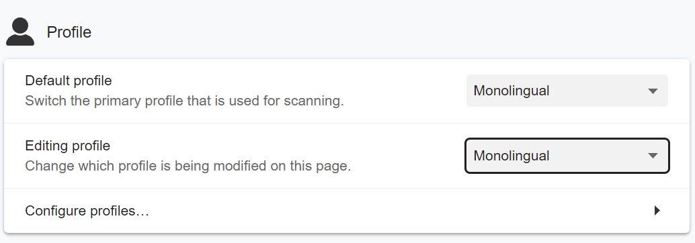

## Anki and Yomitan Format

- Soporte de Pc para: `Monolingual`y `Bilingual`
=== "Anki"
    === "PC | Dark"
        {height=300 width=600}
    === "PC | Light"
        {height=300 width=600}
    === "Mobile | Dark"
        {height=600 width=350}
    === "Mobile | Light"
        {height=600 width=350}
=== "Yomitan"
    === "Yomitan | Dark"
        {height=300 width=600}
    === "Yomitan | Light"
        {height=300 width=600}
    === "Yomitan Profile"
        {height=300 width=600}

#### Anki Features

??? note "Anki Features <small>(click here)</small>"

    Here are the demos for `Interfaz`, `Card Creation` and `Field`:
        
    - This is `already configured` and `you don't have to do anything`
    
    === "Interfaz"
        <video height="300" width="600"  controls>
        <source src="../vid/mining-jp-gui.mp4" type="video/mp4">
        </video>
    === "Card Creation"
        <video height="300" width="600"  controls>
        <source src="../vid/jpmn-card-creation.mp4" type="video/mp4">
        </video>
    === "Field Customization"
        <video height="300" width="600"  controls>
        <source src="../vid/jpmn-field.mp4" type="video/mp4">
        </video>
    
    [Source](https://aquafina-water-bottle.github.io/jp-mining-note/)

---

## [Mining Demo](https://youtu.be/seAMOvIiFcw)
- This is outdated `Anki/Yomitan Format` but the method is pretty much the same

<iframe width="560" height="315" src="https://www.youtube.com/embed/seAMOvIiFcw" title="Mining Demo" frameborder="0" allow="accelerometer; autoplay; clipboard-write; encrypted-media; gyroscope; picture-in-picture; web-share" allowfullscreen></iframe>

[Proceed on Setup Guide](setup.md){ .md-button .md-button }